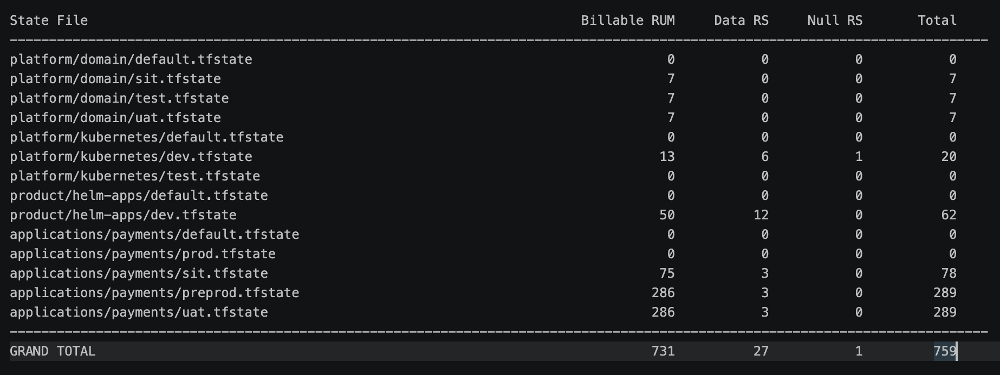

# terraform-gcs-rum-counter

A lightweight Python utility to scan Terraform state files stored in Google Cloud Storage (GCS) and estimate Terraform managed resource (RUM) counts.

The script:

- recursively scans `.tfstate` files in a GCS bucket
- categorizes Terraform resources into:
  - Billable Resources
  - Data Resources
  - Null Resources
- generates a summary table
- exports results into a local report file

---

# Features

- Scan entire GCS buckets recursively
- Optional prefix/folder filtering
- Supports multiple Terraform state files
- Generates per-statefile statistics
- Exports results to:

```text
project/<project_name>.txt
```

- No external helper modules required
- Simple Python-only implementation

---

# Resource Categories

| Category | Description |
|---|---|
| Billable RUM | Real Terraform-managed infrastructure resources |
| Data RS | Terraform `data` resources (read-only lookups) |
| Null RS | Terraform `null_resource` helper resources |

Example:

```hcl
resource "google_compute_instance" "vm" {}
```

→ counted as **Billable RUM**

```hcl
data "google_client_config" "current" {}
```

→ counted as **Data RS**

```hcl
resource "null_resource" "setup" {}
```

→ counted as **Null RS**

---

# Requirements

- Python 3.9+
- Google Cloud SDK (`gcloud`)
- GCS access permissions

Install dependencies:

```bash
python3 -m pip install -r requirements.txt
```

---

# requirements.txt

```text
google-cloud-storage
google-auth
```

---

# Authentication

Authenticate locally using:

```bash
gcloud auth application-default login
```

Verify bucket access:

```bash
gcloud storage ls gs://YOUR_BUCKET/
```

---

# Usage

## Scan Entire Bucket

```bash
python3 terraform_gcs_rum_counter.py \
  --project my-gcp-project \
  --bucket my-terraform-state-bucket
```

---

## Scan Specific Folder/Prefix

```bash
python3 terraform_gcs_rum_counter.py \
  --project my-gcp-project \
  --bucket my-terraform-state-bucket \
  --prefix product/
```

---

## Verbose Output

```bash
python3 terraform_gcs_rum_counter.py \
  --project my-gcp-project \
  --bucket my-terraform-state-bucket \
  --verbose
```

---

# Example Output



---

# Terraform Resource Counting Logic

The script categorizes resources using:

```python
if mode == "data":
    category = "data"

elif resource_type == "null_resource":
    category = "null"

else:
    category = "billable"
```

This approximates Terraform/HCP Terraform managed resource counting.

---

# Terraform Cloud / HCP Terraform Pricing

This script estimates Terraform managed resources (RUM) based on Terraform state files.

Reference pricing:

- HCP Terraform Pricing  
  https://www.hashicorp.com/pricing

- Managed Resource Billing Documentation  
  https://developer.hashicorp.com/terraform/cloud-docs/overview/estimate-hcp-terraform-cost

The counting logic in this project attempts to approximate HashiCorp managed resource billing behavior by excluding:

- Terraform `data` resources
- `null_resource`
- helper/non-managed resources

This project is not affiliated with or endorsed by HashiCorp.

---

# Recommended .gitignore

```gitignore
# Python
__pycache__/
*.pyc

# macOS
.DS_Store

# Virtual environments
venv/
.env

# Terraform
*.tfstate
*.tfstate.backup
.terraform/

# Generated reports
project/
```

---

# Repository Structure

```text
terraform-gcs-rum-counter/
├── terraform_gcs_rum_counter.py
├── README.md
├── requirements.txt
├── LICENSE
├── .gitignore
└── docs/
    └── example-output.png
```

---

# Notes

- Only files ending with `.tfstate` are scanned
- GCS folders are treated as object prefixes
- The script processes all matching objects recursively
- Corrupted or unreadable state files are skipped with error logging

---

# License

MIT License

---

# Disclaimer

This tool provides an estimated Terraform managed resource count and is not an official HashiCorp licensing calculator. Actual Terraform Cloud / HCP Terraform billing may differ depending on plan type, billing model, discounts, and enterprise agreements.